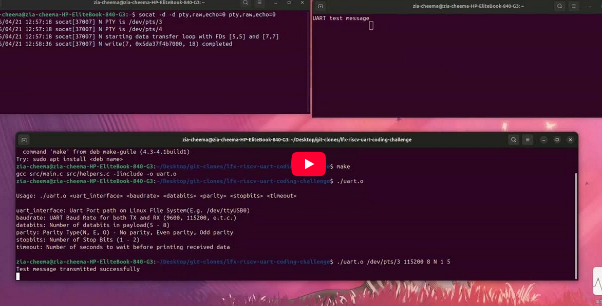

# LFX-RISCV-uart-coding-challenge
This repo contains solution of coding challenge for lfx riscv mentorship summer 2026 - RISC-V ACT Framework Enablement and M-Mode Firmware Validation on Hardware Board.  

## Links
- [Coding Challenge](https://docs.google.com/document/d/1GxVD4id6s_CjGua6F79XqXCnRtG3D5LA4mWdDSSA_BE/edit?tab=t.0)
- [LFX Mentorship](https://mentorship.lfx.linuxfoundation.org/project/bd7b9397-d824-4561-9efc-9f16df4151fe)
- [Termios API Docs](https://man7.org/linux/man-pages/man3/termios.3.html)

---

# Testing and CI
Tested using [socat](https://man7.org/linux/man-pages/man1/socat.1.html) via [nox](https://nox.thea.codes/en/stable/). Tests are based on  the requirements document of Coding Challenge.If you want to understand how socat is used to test this API. Here is a small [demo video](https://youtu.be/ze-gIhe2PXI).Initially socat was used directly in github actions but it was less flexible, Thus nox was a better option for more flexibility and control.`Nox executes and automates same thing shown in demo video but in CI tests` i.e. Github actions. 

[](https://youtu.be/ze-gIhe2PXI)  

---

# Build and Run
First clone the repository. Then to build just execute command `make` in the root directory. 
```bash
git clone https://github.com/ZiaCheemaGit/lfx-riscv-uart-coding-challenge.git
cd lfx-riscv-uart-coding-challenge
make
```
It will output a program named `uart.o`, which can be ran as following
```bash
./uart.o <uart_interface> <baudrate> <databits> <parity> <stopbits> <timeout>
```
All Arguments are mandatory and must be in similar order as shown above 
```text
uart_interface: Uart Port path on Linux File System(E.g. /dev/ttyUSB0)
baudrate: UART Baud Rate for both TX and RX (9600, 115200, e.t.c.)
databits: Number of databits in payload(5 - 8)
parity: Parity Type(N, E, O) - No parity, Even parity, Odd parity
stopbits: Number of Stop Bits (1 - 2)
timeout: Number of seconds to wait before printing received data
```

## Example
```bash
./uart.o /dev/ttyUSB0 9600 8 N 1 5
```

# Documentation
This API satisfies the feautere set described in the Coding Challenge docx file. The main() function is not part of actual API. It is a demo to showcase all the feautures. 

## Front-End Exposures
Following are the API front-end exposures. 

### API Error Codes
```C
# define PORT_INIT_ERROR 103 // Could not open port, Maybe nothing connected yet
# define PORT_ATTR_GET_ERROR 101 // Something went wrong while getting port attributes
# define PORT_ATTR_SET_ERROR 102 // Something went wrong while setting port attributes
# define UART_WRITE_ERROR 104 // write() returned 0 i.e. Nothing written to uart 
# define READ_TIMEOUT_ERROR 105 // timeout while reading received data i.e. No data available to read 
# define SELECT_ERROR 106 // error occcured while execution of select()
# define READ_ERROR 107  // error occured while execution of read()
```

### API Global Variables
```C
extern char *uart_interface; // uart port device path on Linux  
extern int g_fd; // Port's global file descriptor
extern char buffer[256]; // buffer to store read data
extern int bytes; // Number of characters read to buffer
``` 

### Features
```C
// initialize UART Port with provided configurations
// and return file descriptor for the initialized process
int initialize_uart_interface(int baud, int databits, char parity, int stopbits);

// write message data to 
// selected tty* uart interface
int transmit_message(char *message);

// Read data using time out Mechanisim
int receive_message_with_timeout(int time_sec);
```

## Back-End Implementations
```C
// Internal Variable to store port's termios attributes 
struct termios termios_interface_tty;  

// API Internal Helper
// select BUAD RATE corresponding to  options in termios and Default to 115200 otherwise
// More termios supported BAUD Rates can be added later if wanted
// Current Supported Baud Rates 
// 9600
// 19200
// 38400
// 57600
// 115200 Default Value If no match found
speed_t get_baudrate(int baud) 
```
